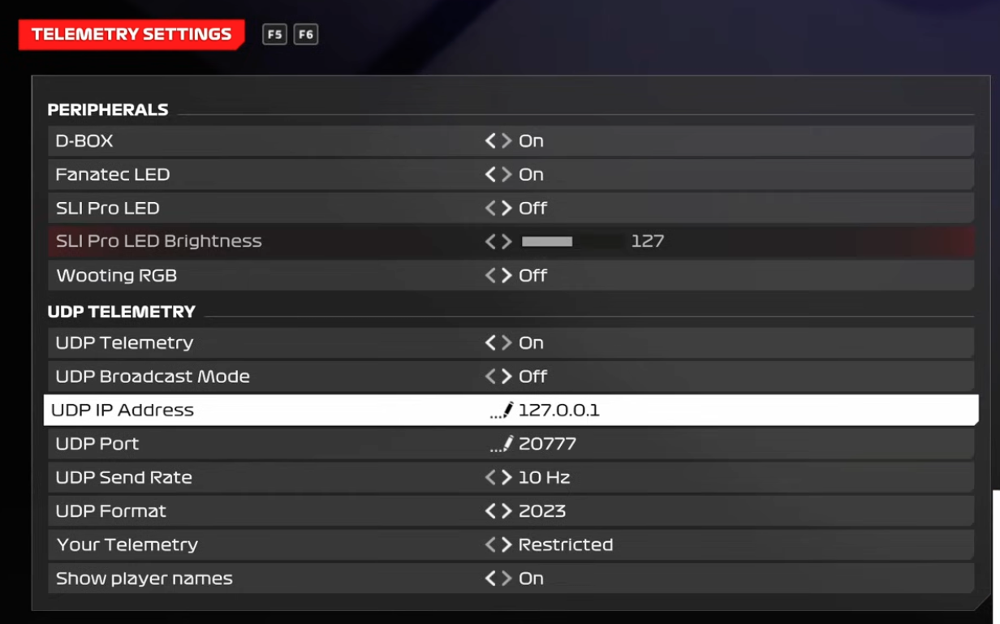
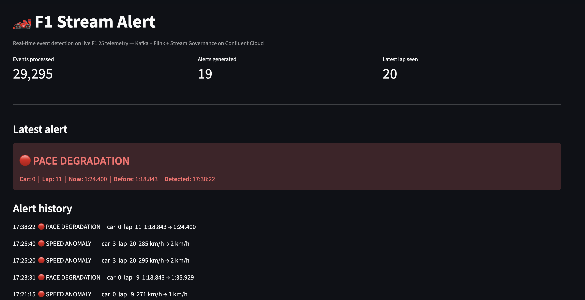
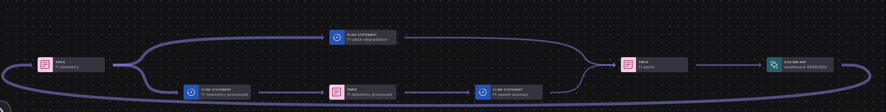

# F1 Stream Alert

Real-time anomaly detection on F1 25 telemetry. The game streams UDP, Python
normalizes it into governed Kafka events, Flink detects incidents, a Streamlit
dashboard shows the alerts.

The F1 data is a stand-in for any high-volume operational stream (IoT,
fraud, infrastructure): raw data → real-time processing → governed,
actionable events.

```
F1 25 ──UDP:20777──▶ Python receiver ──▶ f1.telemetry (JSON Schema)
                                              │
                                            Flink
                                              ├─▶ f1.telemetry.processed
                                              └─▶ f1.alerts (Avro) ──▶ dashboard
```

## Stack

- Python 3.13, `confluent-kafka`, Streamlit
- Confluent Cloud: Basic Kafka cluster + Schema Registry (aws/us-east-2)
- Flink compute pool `f1-flink`, statements in `config/flink/`

## Alert rules

| Rule | Trigger | Severity |
|---|---|---|
| `speed_anomaly` | Speed drops ≥150 km/h vs. the car's peak over the last 2s **and** falls below 30 km/h (near-stop rules out braking for slow corners); max one alert per car per 10s | WARNING, ≥220 km/h drop CRITICAL |
| `pace_degradation` | Completed lap slower than the car's best lap | ≥1.5s WARNING, ≥5s CRITICAL |

Both write to `f1.alerts` with a shared schema:
`event_type, severity, car_index, lap_number, value, previous_value, detected_at`.

## Setup

```bash
python3 -m venv .venv
.venv/bin/pip install -r requirements.txt
cp .env.example .env   # fill in Confluent credentials
```

F1 25 telemetry settings: UDP on, IP = this machine, port 20777, format 2026.
Note: the parser targets the **2026 Season Pack** packet layout (24 cars,
1448-byte telemetry packets), not base F1 25.



## Run

```bash
# terminal 1 — publish telemetry to Kafka
.venv/bin/python -m src.kafka.producer

# terminal 2 — dashboard on :8501
.venv/bin/streamlit run src/dashboard/app.py
```



Drive. Crash. An alert reaches the dashboard in ~1–2 min (Flink watermark +
commit latency on default settings).

Local checks without Confluent: `python3 -m src.telemetry.receiver` (raw
packets), `python3 -m src.telemetry.decode_preview` (decoded values),
`python3 -m src.telemetry.stream` (normalized JSON).

## Diagnostics

```bash
python3 -m unittest discover tests            # parser + normalizer tests
.venv/bin/python scripts/read_alerts.py       # dump f1.alerts
.venv/bin/python scripts/scan_speed_drops.py  # crash signatures in raw stream
```

## Stream Lineage


